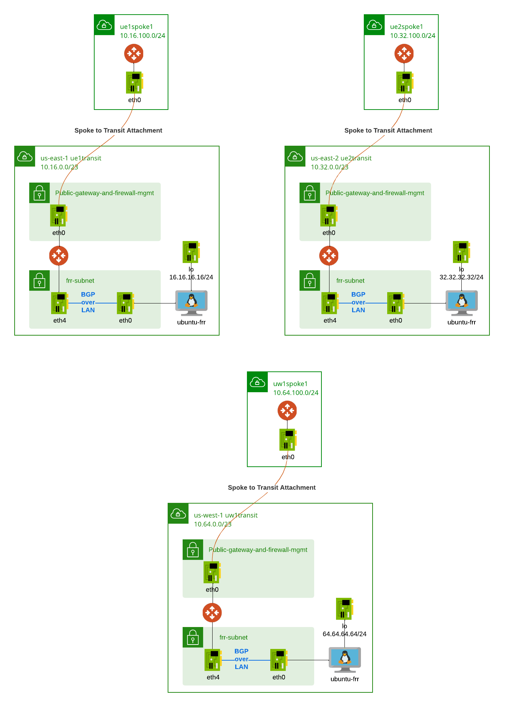

# terraform-aviatrix-aws-multi-region-transit-bgpolan-with-frr-lab

- This repository builds three Aviatrix Spoke/Transit in three different regions
- For each transit VPC, additional frr-subnet (same AZ as primary Transit GW) is created to connect with FRR instance
- FRR instance is provisioned in the frr-subnet, with source/destination check disabled.
- Aviatrix Transit External BGPoLAN connection is created with FRR. Avx Transit GW creats additional eth4 for this connection.
- BGP connection established from FRR to Aviatrix Transit.
- FRR loopback assigned with IP address.
- Avx Transit advertise transit CIDR turned on.

- Try to establish transit peering and observe on both FRR and Transit how addresses are been advertised.
- To redeploy the FRR instance with updated configuration:
    - terraform taint module.region1.module.frr.aws_instance.this
    - terraform taint module.region2.module.frr.aws_instance.this
    - terraform taint module.region3.module.frr.aws_instance.this
    - terraform apply
- To reconnect to FRR instance redeployed, hnow_hosts may still contains the original hash information:
    - rm /Users/<username>/.ssh/known_hosts